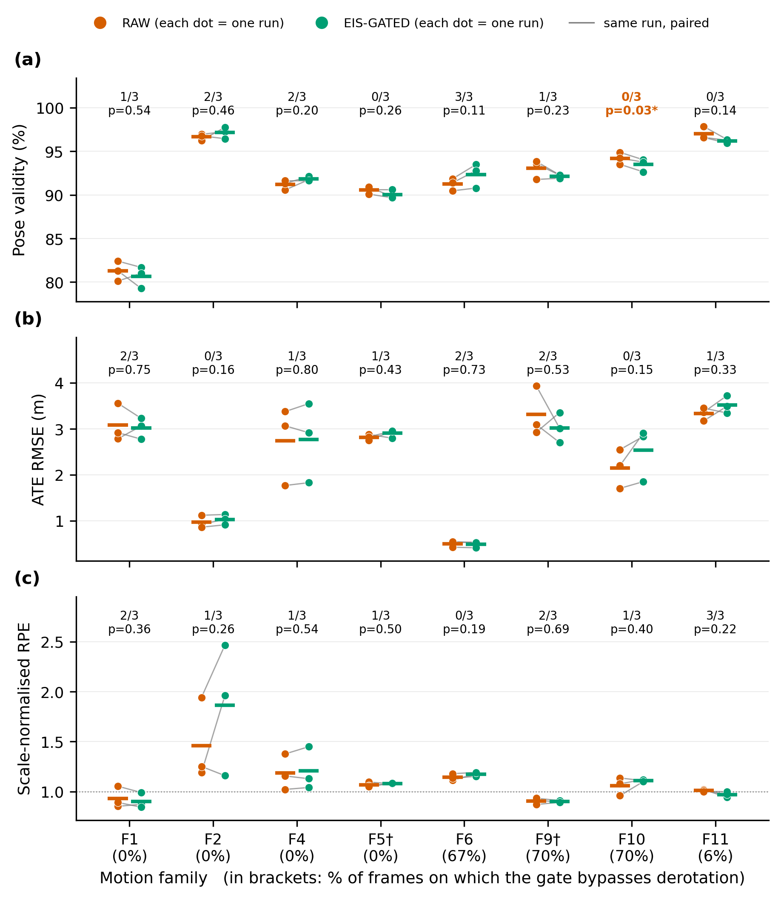
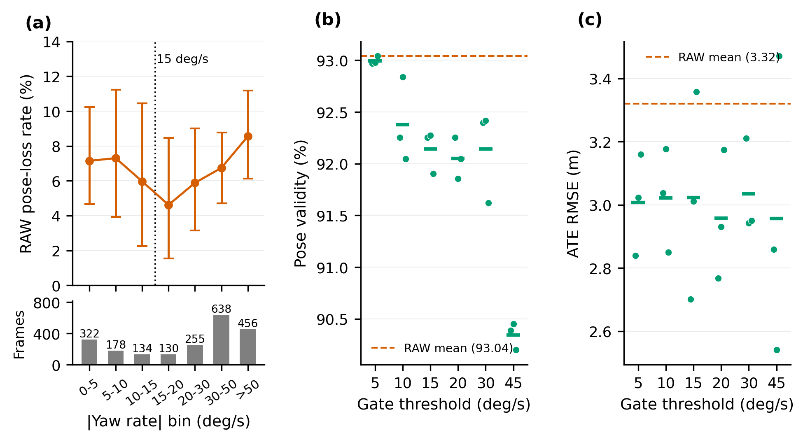
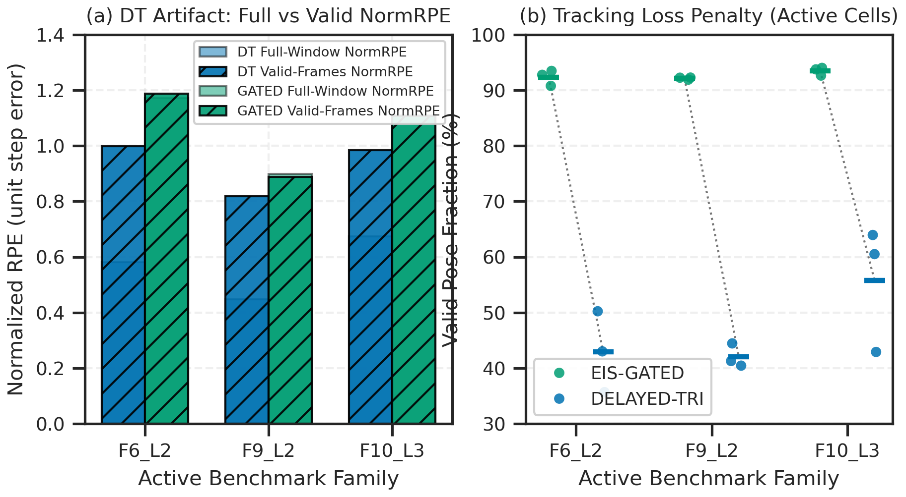
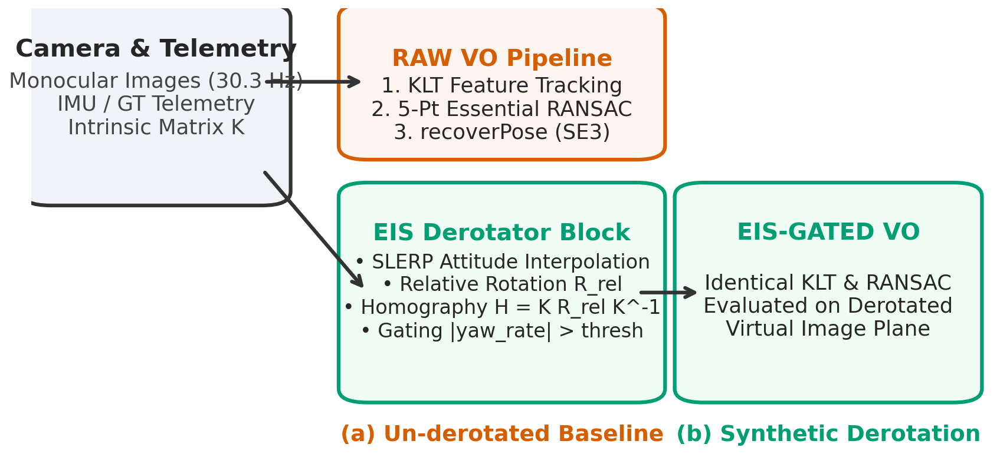

# Robust Monocular Visual Odometry (VO) Under Agile UAV Motion

A ROS 2, Gazebo Sim, and PX4 SITL research framework for quantifying monocular Visual Odometry (VO) performance degradation and evaluating rotation-mitigation mechanisms during dynamic, agile multicopter flight.

> **Preprint:** [Reactive Yaw-Rate Gating Does Not Significantly Improve Monocular Visual Odometry Under Agile UAV Motion](https://doi.org/10.5281/zenodo.22957691) (Zenodo, concept DOI — always resolves to latest version)

---

## Executive Summary & Findings

Monocular Visual Odometry is standard for GPS-denied drone navigation but degrades under high rotational velocities ($\omega_z > 15^\circ/\text{s}$), aggressive maneuvers, and low-parallax flight regimes. 

This repository provides a complete, reproducible controlled-experiment benchmark suite evaluating three VO mechanisms across 36 flight datasets ($n=3$ repeats per cell):
1. **`RAW`**: Un-fused 5-point Essential Matrix RANSAC + Pyramidal KLT feature tracking.
2. **`EIS-GATED`**: Reactive attitude-rate-gated Electronic Image Stabilization (homography derotation active when $|\omega_z| > 15.0^\circ/\text{s}$).
3. **`DELAYED-TRI`**: Rotation-decoupled feature buffering delaying 3D landmark triangulation until rotation subsides.

### Key Conclusions:
- **EIS-GATED vs. RAW is mostly a statistical wash, with one significant result that goes against it.** Of 24 paired core-matrix comparisons (n=3 each), only 1 reaches p < 0.05 -- F10_L3 valid pose %, favoring RAW (p=0.033) -- about what 24 tests would produce by chance alone. On F6_L2 (sustained in-place yaw), EIS-GATED is directionally favorable (better in 3/3 runs) but not significant at n=3 (p=0.11). On translation-dominant flights the gate is mostly inert and results are indistinguishable from RAW.
- **DELAYED-TRI fails structurally under sustained rotation**: valid pose rate collapses to 27-56% on F5/F6/F9/F10. Its apparent RPE advantage there is substantially a zero-motion-fallback metric artifact, not a genuine accuracy gain -- see results/reports/phase3/phase3_controlled_experiment_report.md Section C.

---

## Key Results


**Figure 6. RAW against EIS-GATED on the eight core families (three runs each).**

*Dots: individual runs; lines join the same run under the two mechanisms; bars: family means. Labels give k, the number of runs (of 3) in which EIS-GATED is better, and the paired-t p-value (unadjusted). † marks F5, F9, recorded in the earlier `phase2a_` generation. Of 24 comparisons, 1 has p < 0.05: F10 pose validity, where EIS-GATED is lower in all three runs (mean difference -0.73 percentage points, p = 0.033); with 24 tests this is about what chance alone produces. F9 (yaw plus translation): ATE k = 2/3, p = 0.530; normalised RPE k = 2/3, p = 0.685. The gate bypasses derotation on 67.4%, 70.0%, 70.4% and 6.2% of analysed frames in F6, F9, F10 and F11 and on none in F1, F2, F4 and F5, where EIS-GATED derotates every frame (equivalent to INCREMENTAL): the comparison in those four families is RAW against always-on incremental EIS. EIS-GATED did not significantly improve accuracy over RAW in this study (n = 3).*


**Figure 5. The 15 deg/s gate threshold is a chosen operating point, not an empirically derived optimum.**

*(a) RAW pose-loss rate (frames with fewer than 8 pose inliers) against absolute yaw rate on F9 (three runs pooled; 95% bootstrap intervals; frame counts below). The loss rate is 4.6-8.6% in every bin and the intervals overlap; there is no knee at 15 deg/s. (b, c) Offline replay of the gate on F9 at six thresholds (dots: runs; horizontal marks: means; dashed: RAW mean). In this implementation derotation is applied when the yaw rate is at or below the threshold and bypassed above it, so a higher threshold means more frames are derotated (15.2% of frames at 5 deg/s, 70.6% at 45 deg/s). Validity falls from 93.0% to 90.3% over that range, toward the always-on INCREMENTAL value (88.2%), by less than a uniform-harm interpolation would predict. Mean ATE (2.96-3.03 m) does not separate the thresholds given a between-run standard deviation of 0.15-0.47 m. No threshold is marked as best.*


**Figure 8. Much of delayed triangulation's lower RPE comes from frames on which tracking has failed.**

*F6, F9, F10; dots: runs, horizontal marks: means. (a) Pose validity: DELAYED-TRI 43.0%, 42.1% and 55.8% against 92.3%, 92.1% and 93.5% for EIS-GATED. (b) Scale-normalised RPE over the full window is lower for DELAYED-TRI (0.58, 0.45, 0.67 against 1.17, 0.90, 1.11). (c) Splitting frames by validity: on starved frames (fewer than 8 pose inliers) DELAYED-TRI's RPE is 0.27, 0.18 and 0.30, because a stale pose yields near-zero step error; on valid frames it is 1.00, 0.82 and 0.99, below EIS-GATED's (1.19, 0.89, 1.11) but computed on a much smaller and possibly easier set of frames. RPE for DELAYED-TRI must always be reported together with validity.*


**Figure 12. Processing pipeline for RAW and EIS-GATED.**

*Frames from the simulated camera (1280×960 px, 30.3 Hz measured from frame timestamps) pass through an optional EIS stage, then KLT tracking, five-point essential-matrix RANSAC and `recoverPose` (`distanceThresh` = 1000 in VO units; a frame is valid with at least 8 pose inliers). RAW omits the EIS stage. In EIS-GATED the yaw rate is computed from consecutive attitude samples and the frame is derotated by the incremental relative rotation only when the yaw rate is at or below the threshold τ (15.0 deg/s, a chosen operating point); above it the warp is the identity. Attitude is the simulator's ground-truth quaternion interpolated to frame time, not an estimated IMU attitude.*

---

## Project Phase Breakdown

- **Phase 0 — Infrastructure & Calibration (COMPLETE)**:
  - Pinhole camera verification ($30.4\text{ Hz}$, $1280 \times 960$), Ground Truth pose sync ($\le 20\text{ ms}$), and Sim(3) Umeyama scale alignment.
- **Phase 1 — Baseline Flight Matrix (COMPLETE)**:
  - Standardized benchmark sweep across 8 motion families (F1–F11) in Gazebo `agriculture.world`.
- **Phase 2 — Fault Injection & Mechanism Design (COMPLETE)**:
  - Developed `EIS-GATED` ($\omega_{\text{thresh}} = 15.0^\circ/\text{s}$), scale-normalized RPE ($RPE_{\text{norm}} = RPE/s$), and Visual Field Observatory (VFO) diagnostic engine.
- **Phase 3 — Head-to-Head Benchmark Evaluation (COMPLETE)**:
  - Full matrix evaluation across 8 core families + 4 exploratory families ($N=36$ flights). Definitive scientific report published in `results/reports/phase3/phase3_controlled_experiment_report.md`.

---

## Directory Architecture

```
ROS/
├── configs/                       # World models, ROS 2 bridge configs & intrinsics
├── docs/                          # Methodology, research questions & technical logs
│   ├── SSRF_Research_Plan.docx
│   ├── research_question.md
│   ├── methodology.md
│   ├── environment.md
│   └── failure_log.md             # Master Technical Journal (Entries 1-49)
├── plots/                         # Output visualization charts
├── results/                       # Experimental data outputs & reports
│   ├── datasets/                  # Recorded flight datasets (CSV logs per run)
│   ├── data_tables/               # Tabular audit summaries & JSON manifests
│   └── reports/                   # Markdown scientific research reports
│       ├── phase1/
│       ├── phase2/
│       └── phase3/                # Phase 3 Controlled Experiment Report
├── src/                           # Main Python library and production pipelines
│   ├── core/                      # VO algorithms & preprocessors
│   ├── flight/                    # MAVLink SITL flight controllers
│   ├── pipelines/                 # Batch evaluation entrypoints
│   └── archive_phase0/            # Prototype archival scripts
├── tests/                         # Automated test suite
└── README.md
```

---

## Environment Specifications

- **OS**: Ubuntu 22.04 / 26.04 LTS
- **ROS Distribution**: ROS 2 `humble` / `lyrical`
- **Simulator**: Gazebo Sim / Tools `10.4.0` (Ogre2 engine, NVIDIA GPU offload)
- **Autopilot**: PX4 SITL `v1.18.0-beta1-209-g8aba32c862`
- **Python**: Python 3.10+ / 3.14 (`opencv-python` 4.10, `evo` 1.37.0, `scipy` 1.18.0, `numpy`)

> [!NOTE]
> The controlled/reference world `boxworld_obstacles_tight` (`configs/gazebo_maps`) is not vendored in this repository — it was removed as a broken gitlink with no corresponding `.gitmodules` entry (see commit `543cece`). It is only needed to re-run the `boxworld_obstacles_tight` reference-world comparison; it is not required to reproduce the primary published results, which use the `agriculture.world` benchmark exclusively. To re-fetch it, see [engcang/gazebo_maps](https://github.com/engcang/gazebo_maps) and adjust `GAZEBO_MODEL_PATH` accordingly.

---

## Primary Document References

- **Phase 3 Controlled Experiment Report**: [results/reports/phase3/phase3_controlled_experiment_report.md](results/reports/phase3/phase3_controlled_experiment_report.md)
- **Master Failure Log & Technical Journal**: [docs/failure_log.md](docs/failure_log.md)
- **Research Methodology**: [docs/methodology.md](docs/methodology.md)
- **Environment Setup**: [docs/environment.md](docs/environment.md)
