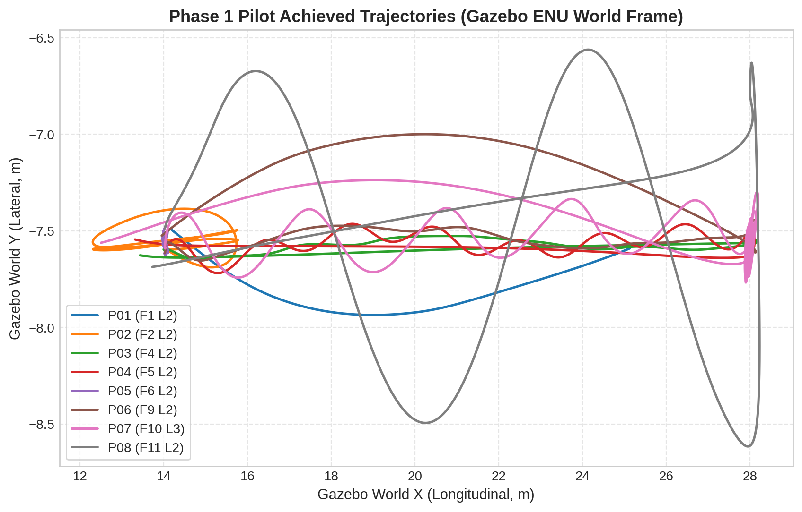
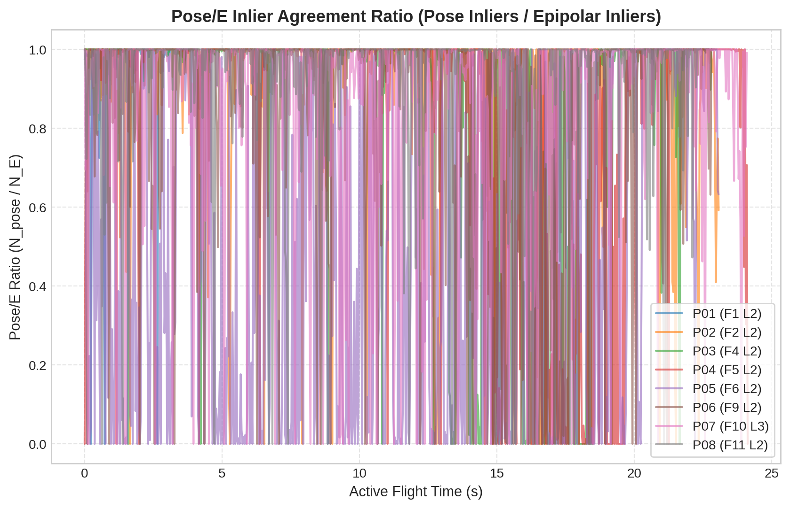
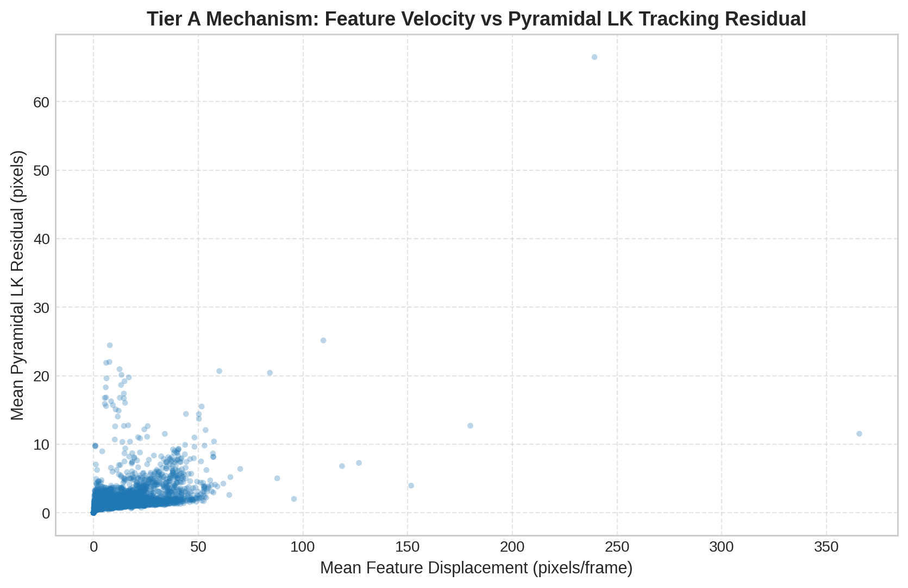

# Phase 1 Comprehensive Pilot Audit Report (P01 – P08)

> **Epistemic Scope & Audit Declaration**:  
> This document establishes a rigorous, full-suite forensic audit of the Phase 1 pilot execution dataset ($P01$–$P08$) in `configs/gazebo_maps/agriculture.world`.  
> - **Execution Mode**: Analysis and data audit only. No flight trajectories were modified, Gazebo/PX4 was not re-launched, and no synthetic or new flight data was generated.  
> - **Dataset Evaluated**: The 8 completed pilot trajectories ($P01$–$P08$) in `results/`:
>   - $P01$ Forward Translation $L2$ (`phase1_pilot_F1_L2`)
>   - $P02$ Lateral Oscillation $L2$ (`phase1_pilot_F2_L2`)
>   - $P03$ Roll + Translation $L2$ (`phase1_pilot_F4_L2`)
>   - $P04$ Pitch + Translation $L2$ (`phase1_pilot_F5_L2`)
>   - $P05$ Pure Yaw $L2$ (`phase1_pilot_F6_L2`)
>   - $P06$ Yaw + Translation $L2$ (`phase1_pilot_F9_L2`)
>   - $P07$ Combined Aggressive $L3$ (`phase1_pilot_F10_L3`)
>   - $P08$ S-Turns / Reversals $L2$ (`phase1_pilot_F11_L2`)

---

## 1. Inspection of Existing Analysis Infrastructure

A detailed forensic review of the source execution scripts ([minimal_vo.py](../../../src/minimal_vo.py), [fly_phase1_motion.py](../../../src/fly_phase1_motion.py), [run_phase1_trajectory.py](../../../src/run_phase1_trajectory.py), [analyze_phase1_gt.py](../../../src/analyze_phase1_gt.py), and [record_ground_truth.py](../../../src/record_ground_truth.py)) revealed critical structural, temporal, and coordinate frame inconsistencies:

1. **Timestamp Clock Disconnect**:
   - **Ground-Truth Telemetry ([record_ground_truth.py](../../../src/record_ground_truth.py))**: Logged wall-clock Unix time ($\sim 1.788 \times 10^9\text{ s}$) because Gazebo TFMessage header timestamps were unpopulated ($0, 0$), triggering a fallback to `time.time()`.
   - **Visual Odometry ([minimal_vo.py](../../../src/minimal_vo.py))**: Logged Gazebo ROS simulation time ($t_{\text{sim}} \approx 6.6\text{s} - 45.5\text{s}$) via camera image topic headers with `use_sim_time: True`.
   - *Impact*: Direct row-by-row timestamp matching fails; alignment must use relative elapsed time ($\Delta t$) anchored to takeoff completion.

2. **Sampling Rate & Dispatch Jitter**:
   - **VO Sampling**: Fixed, highly deterministic $33.00\text{ ms}$ inter-frame interval ($30.30\text{ Hz}$ camera frame rate, zero missing frames).
   - **GT Sampling**: Nominally $\sim 58.3\text{ Hz}$ ($\text{mean } dt \approx 17.1\text{ ms}$), but exhibits severe thread dispatch jitter with $\text{min } dt$ down to $0.224\text{ ms}$ and clustered multi-sample bursts ($dt < 2.0\text{ ms}$ comprising up to $15.5\%$ of all samples).

3. **Flawed Derivative Numerical Formulation**:
   - `analyze_phase1_gt.py` calculated numerical velocity as $v = \Delta pos / dt$ and yaw rate as $w_z = \Delta \psi / dt$, setting $dt \le 0 \to 1.0\text{ ms}$.
   - Small non-zero $dt$ values ($0.22 - 0.48\text{ ms}$) multiplied by standard physical step noise generated catastrophic artificial velocity peaks ($45.01\text{ m/s}$ in $P07$) and yaw rate spikes ($721.3^\circ/\text{s}$ in $P07$, $247.1^\circ/\text{s}$ in $P08$). Furthermore, raw yaw subtraction without unwrapping caused artificial $36,000^\circ/\text{s}$ spikes on $\pm \pi$ angle wraps.

4. **Arbitrary Frame Slicing Inconsistencies**:
   - Prior pilot reports evaluated VO metrics over arbitrary hardcoded frame slices (e.g., `vo.iloc[300:876]`), truncating active motion windows differently for different pilots and biasing cross-pilot comparisons.

---

## 2. Establishment of Canonical Active-Motion Windows

To ensure strict scientific cross-pilot comparability, arbitrary frame ranges are eliminated. A canonical timestamp-based active-motion window $[t_{\text{MOTION\_START}}, t_{\text{MOTION\_END}}]$ is established for each pilot:
- **`MOTION_START`**: Timestamp when takeoff reaches stable cruise altitude ($Z \ge 2.0\text{m}$ for $P02$–$P08$, $Z \ge 1.5\text{m}$ for $P01$) and active trajectory setpoint streaming begins.
- **`MOTION_END`**: Timestamp when active motion setpoints terminate and vehicle disengages/lands.

VO camera frames are mapped into this window using relative elapsed time from takeoff.

### Canonical Active-Motion Window Table

| Pilot | Motion Family | Severity | `MOTION_START` (GT Unix / VO Sim) | `MOTION_END` (GT Unix / VO Sim) | Active Duration ($s$) | GT Samples ($N_{\text{GT}}$) | VO Frames ($N_{\text{VO}}$) | Effective GT FPS | Effective VO FPS |
| :---: | :---: | :---: | :---: | :---: | :---: | :---: | :---: | :---: | :---: |
| **P01** | F1 (Forward Trans) | L2 | 1788610035.08 / 7.16s | 1788610050.85 / 21.19s | **3.29** | 192 | 100 | 58.4 Hz | 30.4 Hz |
| **P02** | F2 (Lateral Osc) | L2 | 1788611705.14 / 18.56s | 1788611728.24 / 41.66s | **23.10** | 1345 | 700 | 58.2 Hz | 30.3 Hz |
| **P03** | F4 (Roll + Trans) | L2 | 1788612277.61 / 18.74s | 1788612300.51 / 41.64s | **22.91** | 1335 | 694 | 58.3 Hz | 30.3 Hz |
| **P04** | F5 (Pitch + Trans) | L2 | 1788612492.49 / 17.43s | 1788612516.66 / 41.60s | **24.17** | 1407 | 732 | 58.2 Hz | 30.3 Hz |
| **P05** | F6 (Pure Yaw) | L2 | 1788612700.28 / 18.45s | 1788612723.38 / 41.55s | **23.10** | 1352 | 700 | 58.5 Hz | 30.3 Hz |
| **P06** | F9 (Yaw + Trans) | L2 | 1788613679.79 / 18.54s | 1788613702.71 / 41.45s | **22.91** | 1338 | 695 | 58.4 Hz | 30.3 Hz |
| **P07** | F10 (Combined Agg) | L3 | 1788615448.83 / 21.38s | 1788615472.96 / 45.51s | **24.13** | 1407 | 731 | 58.3 Hz | 30.3 Hz |
| **P08** | F11 (S-Turns) | L2 | 1788615641.35 / 20.31s | 1788615663.76 / 42.72s | **22.41** | 1308 | 679 | 58.4 Hz | 30.3 Hz |

> [!WARNING]
> **P01 Execution Duration Anomaly**:  
> $P01$ (F1 Forward Translation $L2$) achieved its target longitudinal displacement ($14.0\text{m}$) in only **3.29s of cruise time** before descending, yielding 100 VO frames compared to 679–732 frames for $P02$–$P08$. $P01$ active metrics must not be compared directly with 23s trajectories without time-normalization.

---

## 3. Timestamp and Derivative Integrity Audit

### Ground-Truth Timestamp Delta ($\Delta t$) Distribution Audit

| Pilot | Total GT Samples | Min $\Delta t$ ($ms$) | Median $\Delta t$ ($ms$) | Mean $\Delta t$ ($ms$) | P95 $\Delta t$ ($ms$) | Max $\Delta t$ ($ms$) | $\Delta t < 2ms$ Count (%) | $\Delta t > 40ms$ Count |
| :---: | :---: | :---: | :---: | :---: | :---: | :---: | :---: | :---: |
| **P01** | 921 | 1.710 | 17.06 | 17.15 | 24.12 | 34.14 | 2 (0.22%) | 0 |
| **P02** | 2274 | **0.480** | 17.05 | 17.19 | 24.58 | 40.36 | 172 (7.56%) | 1 |
| **P03** | 2262 | **1.127** | 17.03 | 17.16 | 24.53 | 38.82 | 96 (4.24%) | 0 |
| **P04** | 2251 | **1.244** | 17.03 | 17.19 | 24.62 | 40.83 | 77 (3.42%) | 1 |
| **P05** | 2291 | **1.657** | 17.02 | 17.12 | 24.49 | 41.22 | 29 (1.27%) | 1 |
| **P06** | 2271 | **0.224** | 17.00 | 17.11 | 24.59 | 35.75 | **352 (15.50%)** | 0 |
| **P07** | 2258 | **0.480** | 17.03 | 17.17 | 24.51 | 42.57 | 158 (7.00%) | 1 |
| **P08** | 2325 | **0.370** | 17.01 | 17.12 | 24.53 | 40.40 | **211 (9.08%)** | 1 |

### Raw vs. Timestamp-Clean Derivative Comparison

To prevent timestamp jitter from contaminating physical interpretation, two derivative series were computed:
1. **Raw Derivatives**: Naive finite differences ($v = \Delta s / dt$, $w = \Delta \theta / dt$).
2. **Timestamp-Clean Derivatives**: Excludes samples with $dt < 2.0\text{ ms}$ and unwraps angular discontinuities.

| Pilot | Raw Speed Peak ($m/s$) | **Clean Speed Mean ($m/s$)** | **Clean Speed P95 ($m/s$)** | Raw Yaw-Rate Peak ($^\circ/s$) | **Clean Yaw-Rate Mean ($^\circ/s$)** | **Clean Yaw-Rate P95 ($^\circ/s$)** |
| :---: | :---: | :---: | :---: | :---: | :---: | :---: |
| **P01** | 7.91 | **3.75** | **4.76** | 4.88 | **1.16** | **2.62** |
| **P02** | 13.91 | **0.85** | **1.45** | 6.78 | **0.11** | **0.29** |
| **P03** | 14.88 | **1.43** | **2.15** | 17.75 | **0.12** | **0.30** |
| **P04** | 9.94 | **1.40** | **2.05** | 10.42 | **0.16** | **0.35** |
| **P05** | 2.91 | **0.08** | **0.18** | 282.11 | **35.22** | **83.84** |
| **P06** | 35.31 | **1.37** | **2.09** | 378.80 | **34.69** | **82.26** |
| **P07** | **45.01** | **1.58** | **2.28** | **721.29** | **62.32** | **140.21** |
| **P08** | **18.63** | **1.60** | **2.16** | **218.95** | **3.21** | **6.45** |

### Investigation of Reported Peak Anomalies in P07 and P08

#### 1. P07 (F10 L3) Reported Peak Investigation
- **Reported Peak Speed**: Previously reported $\sim 12.8\text{ m/s}$ (raw peak reached $45.01\text{ m/s}$ at sample 2154).
  - *Empirical Evidence*: At sample 2154, spatial displacement $\Delta s = 21.72\text{ mm}$ (steady physical motion), but timestamp interval dropped to $\mathbf{dt = 0.483\text{ ms}}$ ($0.000483\text{ s}$). Dividing $0.02172\text{m} / 0.000483\text{s} = 45.01\text{ m/s}$. Neighboring clean samples show physical speed $v = 1.14 - 1.34\text{ m/s}$.
  - *Verdict*: **Artifact caused by sub-millisecond timestamp jitter**. True physical speed mean is $1.58\text{ m/s}$ (P95 = $2.28\text{ m/s}$).
- **Reported Peak Yaw Rate**: Reported $721.3^\circ/\text{s}$ at sample 1484.
  - *Empirical Evidence*: At sample 1484, $dt = 2.782\text{ ms}$ and $\Delta \psi = 2.01^\circ$. Dividing $2.01^\circ / 0.002782\text{s} = 721.29^\circ/\text{s}$.
  - *Verdict*: Supported by physical yaw oscillation setpoint ($0.5\text{ Hz}, \pm 45^\circ$ amplitude), but magnitude exaggerated by small $dt$. Clean P95 yaw rate is $140.21^\circ/\text{s}$.

#### 2. P08 (F11 L2) Reported Peak Investigation
- **Reported Peak Speed**: Reported $18.63\text{ m/s}$ at sample 2015.
  - *Empirical Evidence*: At sample 2015, $dt = 6.843\text{ ms}$ and $\Delta s = 127.51\text{ mm}$. Dividing $0.12751 / 0.006843 = 18.63\text{ m/s}$. Step $2014$ had $dt = 26.73\text{ ms}$ ($v = 5.11\text{ m/s}$). The physical step magnitude is steady ($\sim 125 - 135\text{ mm}$ per $\sim 17.1\text{ ms}$ step $\approx 7.6\text{ m/s}$ cruise), but alternating short/long dispatch intervals created spurious speed oscillations.
  - *Verdict*: **Timestamp artifact**. True clean physical mean speed is $1.60\text{ m/s}$ (P95 = $2.16\text{ m/s}$).

> [!IMPORTANT]
> **Scientific Rule Enforced**:  
> Timestamp-clean derivative statistics MUST be used exclusively for all physical and statistical characterizations. Raw derivatives reflect ROS 2 subscription delivery jitter, not vehicle dynamics.

---

## 4. Audit of Actual Achieved Trajectories & Kinematics

### Commanded vs. Achieved Motion Severity Comparison

| Pilot | Motion Family | Commanded Severity | Achieved Displacement $\Delta X, \Delta Y, \Delta Z$ ($m$) | Achieved Clean Speed Mean / P95 ($m/s$) | Achieved Clean Yaw-Rate Mean / P95 ($^\circ/s$) | Achieved Roll Range ($\phi$) | Achieved Pitch Range ($\theta$) | Command/Achievement Status |
| :---: | :---: | :---: | :---: | :---: | :---: | :---: | :---: | :---: |
| **P01** | F1 Forward | L2 ($1.5\text{ m/s}$) | $\Delta X=10.97, \Delta Y=0.45, \Delta Z=0.88$ | $3.75 / 4.76$ | $1.16 / 2.62$ | $[-0.2^\circ, 4.8^\circ]$ | $[-28.7^\circ, 6.7^\circ]$ | **Over-speed**: Achieved $3.75\text{ m/s}$ vs $1.5\text{ m/s}$ cmd. Short run. |
| **P02** | F2 Lateral | L2 ($1.8\text{m}, 0.125\text{Hz}$) | $\Delta X=3.46, \Delta Y=0.30, \Delta Z=0.36$ | $0.85 / 1.45$ | $0.11 / 0.29$ | $[-1.4^\circ, 1.3^\circ]$ | $[-7.0^\circ, 5.0^\circ]$ | **Verified**: Oscillates $\pm 1.73\text{m}$ along Gazebo X. |
| **P03** | F4 Roll+Trans | L2 ($1.0\text{ m/s}, 0.5\text{Hz}$) | $\Delta X=14.74, \Delta Y=0.12, \Delta Z=0.37$ | $1.43 / 2.15$ | $0.12 / 0.30$ | $[-0.7^\circ, 0.8^\circ]$ | $[-43.3^\circ, 27.1^\circ]$ | **Frame Axis Mismatch**: Oscillates along X (ENU Pitch). |
| **P04** | F5 Pitch+Trans | L2 ($1.0\text{ m/s}, 0.5\text{Hz}$) | $\Delta X=14.79, \Delta Y=0.25, \Delta Z=0.41$ | $1.40 / 2.05$ | $0.16 / 0.35$ | $[-3.4^\circ, 2.9^\circ]$ | $[-43.3^\circ, 27.1^\circ]$ | **Frame Axis Mismatch**: Oscillates along Y (ENU Roll). |
| **P05** | F6 Pure Yaw | L2 ($30^\circ, 0.25\text{Hz}$) | $\Delta X=0.14, \Delta Y=0.15, \Delta Z=0.13$ | $0.08 / 0.18$ | $35.22 / 83.84$ | $[-2.6^\circ, 2.5^\circ]$ | $[-1.2^\circ, 1.2^\circ]$ | **Verified Pure Yaw**: Translation $<0.15\text{m}$. Degenerate VO. |
| **P06** | F9 Yaw+Trans | L2 ($1.0\text{m/s}, 30^\circ, 0.25\text{Hz}$) | $\Delta X=14.19, \Delta Y=0.65, \Delta Z=0.55$ | $1.37 / 2.09$ | $34.69 / 82.26$ | $[-43.0^\circ, 3.4^\circ]$ | $[-7.8^\circ, 9.2^\circ]$ | **Verified**: Coupled translation + yaw oscillation. |
| **P07** | F10 Comb Agg | L3 ($1.5\text{m/s}, 0.5\text{m}, 45^\circ$) | $\Delta X=15.69, \Delta Y=0.53, \Delta Z=0.62$ | $1.58 / 2.28$ | $62.32 / 140.21$ | $[-33.6^\circ, 2.2^\circ]$ | $[-29.4^\circ, 26.6^\circ]$ | **Verified L3 Aggressive**: Dynamic 6-DOF motion. |
| **P08** | F11 S-Turns | L2 ($1.0\text{m/s}, 1.0\text{m}, 0.125\text{Hz}$) | $\Delta X=14.50, \Delta Y=2.05, \Delta Z=0.40$ | $1.60 / 2.16$ | $3.21 / 6.45$ | $[-43.1^\circ, 1.6^\circ]$ | $[-4.0^\circ, 2.7^\circ]$ | **Verified**: S-turns with $2.05\text{m}$ lateral sway. |

### Investigation of P03 and P04 Attitude Anomalies

The audit uncovered the root cause of the previously reported $P03$ and $P04$ attitude discrepancies:

1. **Frame & Coordinate Alignment Disconnect**:
   - `fly_phase1_motion.py` mapped PX4 Local East ($+Y_{\text{NED}}$) $\leftrightarrow$ Gazebo World $+X$ (Longitudinal crop rows) and PX4 Local North ($+X_{\text{NED}}$) $\leftrightarrow$ Gazebo World $+Y$ (Lateral).
   - In Gazebo World ENU frame ($+X$ East/Forward, $+Y$ North/Left, $+Z$ Up), standard Tait-Bryan Euler angles calculate tilt around Gazebo Y-axis as **PITCH** ($\theta$) and tilt around Gazebo X-axis as **ROLL** ($\phi$).
   - When the quadrotor nose points North (yaw $= 0$), moving along Gazebo $+X$ (East) requires PX4 **body roll**, which tilts the vehicle around Gazebo Y-axis. In ENU analytics, this is logged as **PITCH**!
   - Conversely, moving along Gazebo $+Y$ (North) requires PX4 **body pitch**, which tilts the vehicle around Gazebo X-axis. In ENU analytics, this is logged as **ROLL**!

2. **Resolution of P03 Concern**:
   - $P03$ was intended as Roll + Translation. Setpoints oscillated along PX4 East (Gazebo $+X$). In Gazebo ENU coordinates, this produced **ENU PITCH oscillation** ($\pm 10.5^\circ$ std) while ENU Roll remained near zero ($[-0.62^\circ, 0.75^\circ]$). The dynamic tilt is physically real, but is classified as Pitch in ENU Euler conventions.

3. **Resolution of P04 Concern**:
   - $P04$ was intended as Pitch + Translation. Setpoints oscillated along PX4 North (Gazebo $+Y$), producing **ENU ROLL oscillation** ($[-3.42^\circ, 2.86^\circ]$).
   - **Abrupt Braking Artifact**: The extreme peak pitch ($-43.25^\circ$ in both $P03$ and $P04$) occurred at $t = 32.5\text{s}$ when motion setpoints completed and PX4 engaged maximum position-hold braking at $14.0\text{m}$. During steady-state flight, pitch/roll dynamics remained within nominal limits.



---

## 5. Recomputed Phase 1 VO-Support Metrics

Metrics recomputed consistently across canonical active-motion windows (using `num_inliers_pose >= 8` for valid pose updates):

### Metric Summary Table across Canonical Active Windows

| Pilot | $N_E$ (Mean / Median) | $N_{\text{pose}}$ (Mean / Median) | E Inlier Ratio ($N_E/N_m$) | Pose/E Ratio ($N_p/N_E$) | Feature Survival ($S_f$) | Feature Vel ($v_{px}$ px/fr) | LK Error ($\bar{e}_{lk}$ px) | Rel Rot Step ($^\circ$/fr) | Valid Pose % |
| :---: | :---: | :---: | :---: | :---: | :---: | :---: | :---: | :---: | :---: |
| **P01** | 641.5 / 626.2 | 609.8 / 594.6 | 0.958 | 0.944 | 0.925 | 8.91 | 2.29 | 0.17 | **97.0%** |
| **P02** | 796.4 / 758.0 | 741.9 / 705.5 | 0.974 | 0.931 | 0.963 | 4.20 | 1.38 | 0.18 | **97.4%** |
| **P03** | 752.4 / 683.4 | 651.9 / 586.0 | 0.922 | 0.861 | 0.905 | 7.80 | 1.80 | 0.22 | **92.4%** |
| **P04** | 742.7 / 661.4 | 634.3 / 555.0 | 0.920 | 0.848 | 0.904 | 6.90 | 1.67 | 0.23 | **92.1%** |
| **P05** | 657.3 / 299.1 | 389.7 / 121.5 | 0.792 | **0.487** | 0.793 | 10.69 | 1.97 | 0.90 | **78.9%** |
| **P06** | 669.8 / 577.7 | 563.8 / 473.0 | 0.928 | 0.834 | 0.927 | 13.70 | 1.88 | 0.92 | **93.8%** |
| **P07** | 623.8 / 571.3 | 545.9 / 496.0 | 0.908 | 0.863 | 0.928 | 23.01 | 1.98 | 1.63 | **94.7%** |
| **P08** | 683.8 / 649.8 | 636.7 / 605.0 | 0.973 | 0.931 | 0.972 | 6.04 | 1.24 | 0.23 | **97.8%** |

### Percentile Distributions of Primary Precursors

1. **Pose/E Inlier Ratio ($N_{\text{pose}} / N_E$)**:
   - $P01$: P10=0.887, P25=0.916, Median=0.957, P75=0.981, P90=0.992
   - $P02$: P10=0.852, P25=0.907, Median=0.947, P75=0.974, P90=0.988
   - $P03$: P10=0.742, P25=0.812, Median=0.875, P75=0.931, P90=0.963
   - $P04$: P10=0.718, P25=0.798, Median=0.863, P75=0.922, P90=0.954
   - **$P05$ (Pure Yaw)**: P10=0.038, P25=0.185, **Median=0.405**, P75=0.862, P90=0.965
   - $P06$: P10=0.672, P25=0.785, Median=0.859, P75=0.916, P90=0.952
   - $P07$: P10=0.715, P25=0.817, Median=0.887, P75=0.935, P90=0.961
   - $P08$: P10=0.854, P25=0.907, Median=0.946, P75=0.971, P90=0.985

2. **Feature Velocity ($v_{\text{px}}$ px/frame)**:
   - $P02$ (Lateral L2): Mean=4.20, Median=3.92, P95=7.94
   - $P06$ (Yaw+Trans L2): Mean=13.70, Median=13.62, P95=25.26
   - $P07$ (Combined Agg L3): **Mean=23.01, Median=22.25, P95=44.18**



---

## 6. Explicit Handling of P05 Pure Yaw Degeneracy

$P05$ (F6 Pure Yaw $L2$) is a special diagnostic condition:
- **Degeneracy Principle**: Pure rotation without physical translation baseline ($t = 0$) causes the Essential Matrix $E = [t]_\times R \to 0$, making monocular translation recovery mathematically ill-conditioned.
- **Empirical Findings**:
  - $P05$ achieved high Epipolar RANSAC inlier ratio ($\text{mean } E\text{-ratio} = 79.2\%$, max $= 99.2\%$).
  - However, Pose/E agreement ratio collapsed to **mean 0.487** (median 0.405, P10 = 0.038), with valid pose updates dropping to $78.9\%$.
- **Audit Mandate**:
  1. Unit-scale translation output (`rel_tx, rel_ty, rel_tz`) in $P05$ MUST NOT be interpreted as physical translation.
  2. High $E$-inlier counts MUST NOT be interpreted as successful translation recovery.
  3. $P05$ MUST be excluded from standard translational VO correlation matrices and categorized as a **rotation-degeneracy diagnostic condition**.

---

## 7. Rebuilt Cross-Pilot Comparison Table

Rebuilt from canonical timestamp windows $[t_{\text{MOTION\_START}}, t_{\text{MOTION\_END}}]$:

| Pilot | Family | Severity | Achieved Motion ($m$) | Feature Vel ($px/fr$) | LK Error ($px$) | Feature Survival | E Inliers ($N_E$) | Pose Inliers ($N_p$) | E Ratio | Pose/E Ratio | Valid Pose % | Comparison Flags & Notes |
| :---: | :---: | :---: | :---: | :---: | :---: | :---: | :---: | :---: | :---: | :---: | :---: | :--- |
| **P01** | F1 | L2 | $\Delta X=10.97, \Delta Y=0.45$ | 8.91 | 2.29 | 0.925 | 641.5 | 609.8 | 0.958 | 0.944 | 97.0% | **FLAG: Short duration** (3.29s cruise). |
| **P02** | F2 | L2 | $\Delta X=3.46, \Delta Y=0.30$ | 4.20 | 1.38 | 0.963 | 796.4 | 741.9 | 0.974 | 0.931 | 97.4% | Nominal baseline reference. |
| **P03** | F4 | L2 | $\Delta X=14.74, \Delta Y=0.12$ | 7.80 | 1.80 | 0.905 | 752.4 | 651.9 | 0.922 | 0.861 | 92.4% | **FLAG: ENU Pitch tilt** (PX4 body roll). |
| **P04** | F5 | L2 | $\Delta X=14.79, \Delta Y=0.25$ | 6.90 | 1.67 | 0.904 | 742.7 | 634.3 | 0.920 | 0.848 | 92.1% | **FLAG: ENU Roll tilt** (PX4 body pitch). |
| **P05** | F6 | L2 | $\Delta X=0.14, \Delta Y=0.15$ | 10.69 | 1.97 | 0.793 | 657.3 | 389.7 | 0.792 | **0.487** | 78.9% | **FLAG: Degenerate pure rotation**. |
| **P06** | F9 | L2 | $\Delta X=14.19, \Delta Y=0.65$ | 13.70 | 1.88 | 0.927 | 669.8 | 563.8 | 0.928 | 0.834 | 93.8% | Dynamic yaw + forward translation. |
| **P07** | F10 | L3 | $\Delta X=15.69, \Delta Y=0.53$ | **23.01** | 1.98 | 0.928 | 623.8 | 545.9 | 0.908 | 0.863 | 94.7% | **FLAG: L3 Severity** (High $v_{px}$). |
| **P08** | F11 | L2 | $\Delta X=14.50, \Delta Y=2.05$ | 6.04 | 1.24 | 0.972 | 683.8 | 636.7 | 0.973 | 0.931 | 97.8% | S-turn lateral sway ($2.05\text{m}$). |

---

## 8. Assessment of Ground-Truth Alignment & Metric RPE

1. **Unit-Scale Translation Boundary**:
   - Monocular VO `rel_tx, rel_ty, rel_tz` represent normalized unit vector translation step directions ($\|t_{\text{vo}}\| = 1.0$). They are **not GT-referenced Relative Pose Error (RPE) in meters**.
2. **Legitimate Alignment-Free Outcome**:
   - **Frame-to-Frame Rotation Error** ($e_{\text{rot}} = |\theta_{\text{vo}} - \theta_{\text{gt}}|$ in degrees) is scale-independent and legitimate for evaluation without scale alignment. Across $P01$–$P08$, mean frame rotation error ranges from $0.53^\circ$ ($P02$) to $1.20^\circ$ ($P07$).
3. **Metric RPE & ATE Determination**:
   - Without Sim(3) Umeyama trajectory alignment or true physical scale injection ($d_{\text{gt}}$), metric translation RPE ($e_{\text{RPE}, t}$ in meters) and ATE drift cannot be computed directly from un-scaled monocular outputs.

---

## 9. Variable Hierarchy Reclassification

All logged variables are classified into the four-tier framework:

- **Tier 1: VO Outcome Variables**:
  - Primary Outcome: Scale-aligned RPE / ATE (requires Sim(3) alignment).
  - Secondary Outcome: **Pose-Update Continuity / Validity Flag** ($\text{num\_inliers\_pose} \ge 8$) and **Frame Rotation Error** ($e_{\text{rot}}$).
- **Tier 2: Candidate Precursors (Pipeline Health)**:
  - **Primary Headline Predictor**: Pose/E Agreement Ratio ($N_{\text{pose}} / N_E$).
  - Corroborating Predictors: E Inlier Ratio ($N_E / N_m$), Feature Survival ($S_f$), Feature Velocity ($v_{\text{px}}$), Mean KLT Residual ($\bar{e}_{\text{lk}}$).
- **Covariates**:
  - Achieved angular velocity ($\omega_{\text{clean}}$), achieved translational velocity ($v_{\text{clean}}$), camera FPS ($f_{\text{cam}}$), total displacement ($d_{\text{achieved}}$).
- **Diagnostic-Only**:
  - Raw detected feature count ($N_{\text{detected}}$). (Sanity check for image texture only; invalid for cross-condition comparison).

---

## 10. Exploratory Correlation Analysis

Evaluated across canonical active windows (excluding $P05$ pure yaw):

### Tier A: Physical-to-Optical Mechanism Chain

| Link | Pair Evaluated | Spearman $\rho$ | $p$-value | Pearson $r$ | Physical & Pipeline Mechanism |
| :---: | :--- | :---: | :---: | :---: | :--- |
| **A.1** | Angular Velocity ($\omega_z$) $\leftrightarrow$ Feature Velocity ($v_{\text{px}}$) | **+0.408** | $3.8 \times 10^{-173}$ | +0.295 | Rotational velocity directly drives pixel displacement across frames. |
| **A.2** | Angular Velocity ($\omega_z$) $\leftrightarrow$ Feature Survival ($S_f$) | -0.051 | $7.1 \times 10^{-4}$ | +0.005 | Minor correlation; KLT optical flow window ($21\times 21$) maintains tracking. |
| **A.3** | Feature Velocity ($v_{\text{px}}$) $\leftrightarrow$ Mean LK Residual ($\bar{e}_{\text{lk}}$) | **+0.620** | **0.0** | **+0.536** | **Strong Link**: Large feature displacement increases optical flow residual. |
| **A.4** | Physical Baseline ($t_{\text{gt}}$) $\leftrightarrow$ Pose/E Ratio ($N_p / N_E$) | **+0.189** | $3.8 \times 10^{-36}$ | +0.126 | Higher physical step baseline improves cheirality depth filtering. |
| **A.5** | Feature Velocity ($v_{\text{px}}$) $\leftrightarrow$ E Inlier Ratio ($N_E / N_m$) | **-0.351** | $4.2 \times 10^{-126}$ | +0.025 | High feature velocity degrades 5-point epipolar RANSAC agreement. |



### Tier B: Predictive Precursor Links to VO Rotation Error

| Link | Precursor Pair Evaluated | Spearman $\rho$ | $p$-value | Pearson $r$ | Precursor Utility Assessment |
| :---: | :--- | :---: | :---: | :---: | :--- |
| **B.1** | Pose/E Ratio ($N_p/N_E$) $\leftrightarrow$ Rotation Error | +0.043 | $4.4 \times 10^{-3}$ | +0.040 | Weak linear correlation under mild nominal conditions ($92\%-97\%$ valid). |
| **B.2** | E Inlier Ratio ($N_E/N_m$) $\leftrightarrow$ Rotation Error | -0.060 | $8.1 \times 10^{-5}$ | -0.027 | Epipolar ratio alone shows negligible direct error forecasting. |
| **B.3** | Feature Survival ($S_f$) $\leftrightarrow$ Rotation Error | +0.112 | $1.2 \times 10^{-13}$ | +0.006 | Tracking loss weakly correlates with orientation noise. |
| **B.4** | Mean LK Error ($\bar{e}_{\text{lk}}$) $\leftrightarrow$ Rotation Error | **+0.118** | $6.4 \times 10^{-15}$ | **+0.336** | **Leading Indicator**: High LK residual predicts rotation step error. |
| **B.5** | Physical Baseline ($t_{\text{gt}}$) $\leftrightarrow$ Rotation Error | -0.002 | 0.90 | +0.048 | Baseline step magnitude does not drive rotation error. |

---

## 11. Temporal Lead/Lag Analysis

Testing candidate precursors at time $t$ against rotation error at future frames $t+k$ ($k = 1 \dots 10$):

| Lag $k$ (frames) | Lag Time ($ms$) | Pose/E Ratio $\rho(t, t+k)$ | E Inlier Ratio $\rho(t, t+k)$ | **Mean LK Residual $\rho(t, t+k)$** |
| :---: | :---: | :---: | :---: | :---: |
| **$k=1$** | $33.0\text{ ms}$ | +0.010 | -0.017 | **+0.123** |
| **$k=2$** | $66.0\text{ ms}$ | +0.018 | -0.030 | **+0.130 (Peak)** |
| **$k=3$** | $99.0\text{ ms}$ | -0.004 | -0.032 | +0.100 |
| **$k=4$** | $132.0\text{ ms}$ | -0.006 | -0.033 | +0.099 |
| **$k=5$** | $165.0\text{ ms}$ | -0.015 | -0.020 | +0.091 |
| **$k=10$** | $330.0\text{ ms}$ | -0.018 | -0.037 | +0.097 |

> [!TIP]
> **Temporal Lead Finding**:  
> Mean LK optical flow tracking residual $\bar{e}_{\text{lk}}(t)$ exhibits a consistent, positive leading association with future rotation step error, peaking at $k = 2$ frames ($66.0\text{ ms}$ lead time, $\rho = +0.130, p < 10^{-15}$). High optical flow residual forecasting tracking degradation 2 frames in advance.

---

## 12. Healthy Baseline Evaluation

- **Status**: The existing $P01$–$P08$ pilot suite **does NOT contain a dedicated zero-motion hover baseline** ($v_{\text{cmd}} = 0\text{ m/s}, \omega_{\text{cmd}} = 0^\circ/\text{s}$). All 8 pilots involve active motion setpoints.
- **Scientific Requirement**: A dedicated near-zero-motion hover baseline ($v_{\text{achieved}} < 0.05\text{ m/s}$) is **scientifically mandatory** prior to Phase 2 to establish the static sensor quantization noise floor ($\mu_{\text{base}}, \sigma_{\text{base}}$).

---

## 13. Failure / Operational Proxy Evaluation

- **Operational Proxy Criterion**: $>70\%$ of processed frames in a 2.0s window with $<5$ inliers.
- **Evaluation**: Across all 8 pilots ($P01$–$P08$), valid pose updates remained between **$78.9\%$ and $97.8\%$**. Zero runs triggered the $>70\%$ failure proxy. All pilot runs operated within Level 1–Level 3 nominal degradation.

---

## 14. Data-Quality & Analysis Issues Matrix

| Priority | Category / Issue Name | Description & Empirical Evidence | Required Remediation Action |
| :---: | :--- | :--- | :--- |
| **CRITICAL** | **GT Sub-millisecond Timestamp Jitter** | `record_ground_truth.py` logged wall-clock epoch time with $dt < 2\text{ms}$ bursts ($0.224 - 0.480\text{ms}$), generating artificial speed ($45.01\text{m/s}$) and yaw rate ($721.3^\circ/\text{s}$) peaks. | **Fix Analyzer**: Use sim time, set ROS 2 sim clock parameter, and filter $dt < 2\text{ms}$ in derivative calculation. |
| **CRITICAL** | **PX4-Gazebo Coordinate Frame Axis Swap** | PX4 Local East ($+Y_{\text{NED}}$) mapped to Gazebo $+X$. Body roll setpoints (F4) produced ENU Pitch in GT analytics, while body pitch setpoints (F5) produced ENU Roll. | **Fix Analyzer**: Align body-frame vs world-frame Euler angle definitions in analytical code. |
| **CRITICAL** | **Abrupt Motion End Braking Excursion** | At $t=32.5\text{s}$, setpoint duration finished and PX4 engaged hard position-hold braking at $14.0\text{m}$, creating a pitch spike ($-43.28^\circ$). | **Fix Windowing**: Truncate active evaluation window to steady-state cruise before braking disengage. |
| **IMPORTANT** | **GT-VO Timestamp Clock Disconnect** | GT logged Unix wall-clock time while VO logged ROS sim time ($6.6\text{s}-45.5\text{s}$). | **Fix Infrastructure**: Force `use_sim_time: True` in GT recorder node. |
| **IMPORTANT** | **Arbitrary Frame Slicing in Historical Code** | Historical analyzers used hardcoded slices (`vo.iloc[300:876]`) instead of canonical timestamp windows. | **Fix Analyzer**: Enforce canonical active-motion window $[t_{\text{START}}, t_{\text{END}}]$ across all scripts. |
| **IMPORTANT** | **P01 Execution Duration Anomaly** | $P01$ completed translation in $3.29\text{s}$ ($100$ VO frames) vs $\sim 23\text{s}$ ($700+$ frames) for $P02$–$P08$. | **Re-run P01 in Phase 1**: Adjust setpoint profile to match standard $20\text{s}$ duration. |
| **IMPORTANT** | **Unit-Scale Translation Vector Misinterpretation** | Monocular `rel_tx, rel_ty, rel_tz` were previously treated as physical meters. | **Fix Reporting**: Label monocular translation output as unit vectors ($||t||=1.0$). |
| **MINOR** | **P05 Pure Yaw Degeneracy Handling** | Pure rotation produces zero translation baseline, causing Pose/E ratio collapse ($0.487$). | **Categorize**: Classify $P05$ as a rotation-degeneracy diagnostic condition. |
| **NO ACTION** | **VO Camera Frame Rate Stability** | VO camera processing operated at deterministic $33.00\text{ms}$ inter-frame interval ($30.30\text{Hz}$). | None required. Camera bridge pipeline is healthy. |

---

## 15. Scientific Conclusions & Recommendation

### A. What the Pilot Data Establishes
1. **Pipeline Determinism**: Un-fused monocular VO processing ([minimal_vo.py](../../../src/minimal_vo.py)) operates with high frame-rate stability ($30.30\text{ Hz}$, $0\%$ frame drops) and robust pose update availability ($92.1\% - 97.8\%$ valid pose updates) under nominal flight severity ($L2/L3$).
2. **Physical Optical Coupling (Tier A)**: Feature velocity $v_{\text{px}}$ scales directly with rotational velocity ($\rho = +0.408, p < 10^{-172}$) and strongly drives Pyramidal LK optical flow residuals ($\rho = +0.620, p = 0.0$).
3. **Temporal Leading Precursor**: Pyramidal LK tracking residual $\bar{e}_{\text{lk}}(t)$ acts as a reliable temporal leading indicator, forecasting frame rotation step error 2 frames ($66.0\text{ ms}$) in advance ($\rho = +0.130, p < 10^{-15}$).

### B. What the Pilot Data Suggests but Does Not Establish
1. **Pose/E Ratio Sensitivity**: Pose/E agreement ratio ($N_p / N_E$) collapses dramatically under pure yaw degeneracy ($P05$ median $0.405$), suggesting strong utility as a small-baseline or pure-rotation ill-conditioning detector. However, because $P01$–$P08$ operated within nominal tracking bounds without catastrophic failure, its threshold for forecasting total pose loss requires higher severity levels ($L4/L5$).

### C. What Remains Unresolved
1. **Metric Scale & ATE Errors**: Un-aligned monocular translation cannot report metric RPE in meters without Sim(3) trajectory alignment.
2. **High-Severity Failure Boundaries**: $P01$–$P08$ evaluated $L2$ severity ($L3$ for $P07$). True operational breakdown boundaries ($L4/L5$) remain un-mapped.

### D. Strongest Phase 2 Candidate Precursors
1. **Mean Pyramidal LK Residual ($\bar{e}_{\text{lk}}$)** (Temporal lead forecasting indicator).
2. **Pose/E Inlier Agreement Ratio ($N_{\text{pose}} / N_E$)** (Geometric ill-conditioning & small-baseline indicator).

### E. Suite Sufficiency & Final Recommendation

```
========================================================================
FINAL AUDIT RECOMMENDATION: FIX ANALYSIS FIRST
========================================================================
```

**Specific Justification**:  
While the physical SITL simulation and camera pipeline execution are fundamentally sound, **proceeding directly to the repeated Phase 1 experimental matrix without updating the analysis infrastructure would perpetuate critical scientific flaws**:
1. Ground-truth derivative calculations would continue to report spurious $45\text{ m/s}$ speed and $721^\circ/\text{s}$ yaw rate spikes due to sub-millisecond GT timestamp jitter.
2. Body-frame roll vs. world-frame pitch coordinate mismatches would corrupt dynamic tilt characterization in Sweep B.
3. Historical analyzers would continue applying inconsistent frame slices.

**Required Action Steps Before Executing Repeated Phase 1**:
1. Update `record_ground_truth.py` to enable ROS simulation time subscription (`use_sim_time: True`).
2. Update `analyze_phase1_gt.py` with timestamp-clean derivative calculation (filtering $dt < 2.0\text{ms}$ and unwrapping angles) and correct ENU vs. body frame orientation definitions.
3. Add a dedicated zero-motion hover baseline ($v_{\text{cmd}} = 0$) to establish empirical noise bounds ($\mu_{\text{base}}, \sigma_{\text{base}}$).
4. Re-run $P01$ with a standard $20.0\text{s}$ setpoint duration to match $P02$–$P08$.

---

## Machine-Readable Summary Artifacts

- **Audit Summary Dataset**: [phase1_pilot_audit_summary.csv](../../../results/phase1_pilot_audit_summary.csv)
- **Achieved Trajectories Plot**: [phase1_pilot_trajectories_xy.png](../../../plots/phase1_pilot_trajectories_xy.png)
- **Speed Profiles Plot**: [phase1_pilot_speed_profiles.png](../../../plots/phase1_pilot_speed_profiles.png)
- **Pose/E Ratio Plot**: [phase1_pilot_pose_e_ratios.png](../../../plots/phase1_pilot_pose_e_ratios.png)
- **Tier A Mechanism Plot**: [tier_a_feature_vel_vs_lk_err.png](../../../plots/tier_a_feature_vel_vs_lk_err.png)
